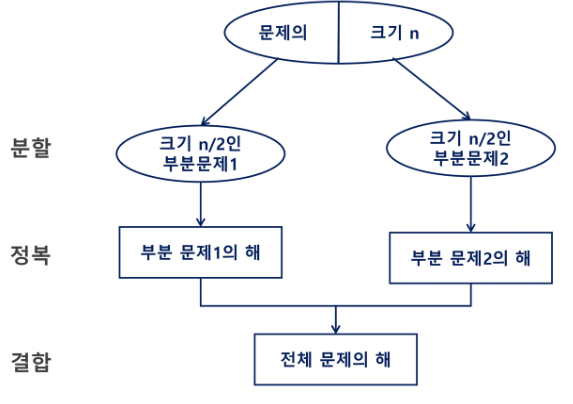

# 분할 정복

- 분할(Divide): 해결할 문제를 여러 개의 작은 부분으로 나눈다
- 정복(Conquer): 나눈 작은 문제를 각각 해결한다
- 통합(Combine): 해결된 해답을 모은다



## 	병합 정렬(Merge Sort)

- 여러 개의 정렬된 자료의 집합을 병합하여 한 개의 정렬된 집합으로 만드는 방식
- 분할 정복 알고리즘 활용
  - 자료를 최소 단위의 문제까지 나눈 후에 차례대로 정렬하여 최종 결과를 얻어냄
  - top-down 방식
- 시간복잡도
  - O(n * log n)


## 예시 코드

### 분할 과정

```python
def merge_sort(arr):
    if len(arr) == 1:
        return arr
    else:
        mid = len(arr)//2
        left_list = merge_sort(arr[:mid])
        right_list = merge_sort(arr[mid:])
        return merge(left_list, right_list)
```

### 병합 과정

```python
def merge(left, right):
    result = []
    li, ri = 0, 0
    while len(left) > li or len(right) > ri:
        if len(left) > li and len(right) > ri:
            if left[li] <= right[ri]:
                result.append(left[li])
                li += 1
            else:
                result.append(right[ri])
                ri += 1
        elif len(left) > li:
            result.append((left[li]))
            li += 1
        elif len(right) > ri:
            result.append((right[ri]))
            ri += 1
    return result
```

> 인덱스를 지정하는 방식이 슬라이싱보다 메모리를 많이 사용하지만 속도면에서 더 유용하다


## 	퀵 정렬

- 주어진 배열을 두 개로 분할하고, 각각을 정렬한다
- 병합 정렬과 다른점
  - 병합 정렬은 그냥 두 부분으로 나누는 반면, 퀵 정렬은 분할할 때, 기준 아이템(pivot item) 중심으로 이보다 작은 것은 왼편, 큰 것은 오른편에 위치시킨다.
  - 각 부분 정렬이 끝난 후, 병합 정렬은 병합과정이 필요하지만 퀵 정렬은 필요하지 않다


## 	이진 검색(Binary Search)

- 자료의 가운데에 있는 항목의 키 값과 비교하여 다음 검색의 위치를 결정하고 검색을 계속 진행하는 방법
  - 목적 키를 찾을 떄까지 이진 검색을 순환적으로 반복 수행함으로써 검색 범위를 반으로 줄여가면서 보다 빠르게 검색을 수행함
- **이진 검색을 하기 위해서는 자료가 정렬된 상태여야 한다**

- 검색 과정
  1. 자료의 중앙에 있는 원소를 고른다
  2. 중앙 원소의 값과 찾고자 하는 목표 값을 비교한다
  3. 목표 값이 중앙 원소의 값보다 작으면 자료의 왼쪽 반에 대해서 새로 검색을 수행하고, 크다면 자료의 오른쪽 반에 대해서 새로 검색을 수행한다
  4. 찾고자 하는 값을 찾을 때까지 1~3의 과정을 반복한다

