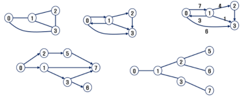
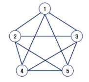

# 그래프

- 아이템(사물 또는 추상적 개념)들과 이들 사이의 연결 관계를 표현

- 정점(Vertex)들의 집합과 이들을 연결하는 간선(Edge)들의 집합으로 구성된 자료 구조

  - V: 정점의 개수, E: 그래프에 포함된 간선의 개수
  - V 개의 정점을 가지는 그래프는 최대 V*(V-1)/2 간선이 가능

- 유형

  - 무향 그래프(Undirected Graph)

  - 유향 그래프(Directed Graph)

  - 가중치 그래프(Weighted Graph)

  - 사이클 없는 방향 그래프(DAG, Directed Acyclic Graph)

    

  - 완전 그래프

    

- 인접 정점
  - 두 개의 정점에 간선이 존재(연결됨)하면 서로 인접해 있다고 한다
  - 완전 그래프에 속한 임의의 두 정점들은 모두 인접해 있다

> 단순 경로: 경로 중 한 정점을 최대한 한번만 지나는 경로
>
> 사이클: 시작한 정점에서 끝나는 경로

- 인접 행렬
  - 두 정점을 연결하는 간선의 유무를 행렬로 표현
  - V * V 정방 행렬
  - 행 번호와 열 번호는 그래프의 정점에 대응
  - 두 정점이 인접되어 있으면 1, 그렇지 않으면 0으로 표현
  - 무향 그래프
    - i번째 행의 합 = i번째 열의 합 = Vi의 차수
  - 유향 그래프
    - 행 i의 합 = Vi의 진출 차수
    - 열 i의 합 = Vi의 진입 차수
- 인접 리스트
  - 각 정점에 대한 인접 정점들을 순차적으로 표현
  - 하나의 정점에 대한 인접 정점들을 각각 노드로 하는 연결 리스트로 저장

## 	그래프 탐색

- 그래프 순회는 비선형 구조인 그래프로 표현된 모든 자료(정점)를 빠짐없이 탐색하는 것을 의미한다
- 방법
  - 깊이 우선 탐색(DFS, Depth First Search)
  - 너비 우선 탐색(BFS, Breadth First Search)

### DFS

- 시작 정점의 한 방향으로 갈 수 있는 경로가 있는 곳까지 깊이 탐색하다 더 이상 갈 곳이 없게 되면, 가장 마지막에 만났던 갈림길 간선이 있는 정점으로 되돌아 와서 다른 방향의 정점으로 탐색을 계쏙 반복하여 결국 모든 정점을 방문하는 순회방법

- 가장 마지막에 만났던 갈림길의 정점으로 되돌아가서 다시 깊이 우선 탐색을 반복해야 하므로 후입선출 구조의 스택 사용

- 스택(stack)의 특성

  - 물건을 쌓아 올리듯 자료를 쌓아 올린 형태의 자료구조
  - 선형구조: 자료 간의 관계가 1대1의 관계를 갖는다
    - 비선형구조: 자료 간의 관계의 1대N의 관계를 갖는다(Ex: 트리)
  - 마지막에 삽입한 자료를 가장 먼저 꺼낸다
    - 후입선출(LIFO, Last-In-First-Out)

  |  push   | 저장소에 자료를 삽입(저장)한다               |
  | :-----: | -------------------------------------------- |
  |   pop   | 저장소에서 자료를 꺼낸다                     |
  | isEmpty | 스택이 공백인지 아닌지를 확인하는 연산       |
  |  peek   | 스택의 top에 있는 item(원소)을 반환하는 연산 |

  

### BFS

- 너비우선탐색은 탐색 시작점의 인접한 정점들을 먼저 모두 차례로 방문한 후에, 방문했던 정점을시작점으로 하여 다시 인접한 정점들을 차례로 방문하는 방식
- 인접한 정점들에 대해 탐색을 한 후, 차례로 다시 너비우선 탐색을 진행해야 하므로, 선입선출 형태의 자료구조인 큐를 활용함
- 큐(Queue)의 특성
  - 스택과 마찬가지로 삽입과 삭제의 위치가 제한적인 자료구조
  - 큐에 삽입한 순서대로 원소가 저장되어 가장 먼저 삽입된 원소는 가장 먼저 삭제
    - 선입선출구조(FIFO, First In First Out)

- 큐의 구현

  - 삽입: enQueue
    - 마지막 원소 뒤에 새로운 원소를 삽입하기위해 rear 값을 하나 증가시켜 새로운 원소를 삽입할 자리를 마련
    - 그 인덱스에 해당하는 배열원소를 저장

  - 삭제: deQueue
    - 가장 앞에 있는 원소를 삭제하기 위해 front 값을 하나 증가시켜 큐에 남아있게 될 첫번째 원소 이동
    - 새로운 첫번째 원소를 리턴함으로써 삭제와 동일한 기능
  - 공백상태 및 포화상태 검사: isEmpty, isFull
    - 공백상태: front = rear
    - 포화상태: rear = n-1

  

## 	최소 신장 트리(MST)

- 그래프에서 최소 비용 문제
  - 모든 정점을 연결하는 간선들의 가중치의 합이 최소가 되는 트리
  - 두 정점 사이의 최소 비용의 경로 찾기
- 신장 트리
  - n 개의 정점으로 이루어진 무방향 그래프에서 n개의 정점고 n-1개의 간선으로 이루어진 트리
- 최소 신장 트리
  - 무방향 가중치 그래프에서 신장 트리를 구성하는 간선들의 가중치의 합이 최소인 신장 트리

### Prim 알고리즘

- 하나의 정점에서 연결된 간선들 중에 하나씩 선택하면서 MST를 만들어 가는 방식
  1. 임의 정점을 하나 선택해서 시작
  2. 선택한 정점과 인접하는 정점들 중의 최소 비용의 간선이 존재하는 정점을 선택
  3. 모든 정점이 선택될 때까지 1, 2를 반복
