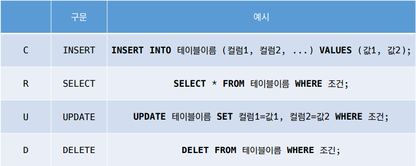

# [⭕](https://apps.timwhitlock.info/emoji/tables/unicode#emoji-modal)DataBase

- 데이터 베이스는체계화된 데이터의 모임
- 몇 개의 자료 파일을 조직적으로 통합하여 자료 항목의 중복을 없애고 자료를 구조화하여 기억시켜 놓은 자료의 집합체

> 데이터 베이스로 얻는 장점들:
>
> - 데이터 중복 최소화
> - 데이터 무결성
> - 데이터 일관성
> - 데이터 독립성
> - 데이터 표준화
> - 데이터 보안 유지


## RDB

- 관계형 데이터 베이스(RDB)

  - Relational Database
  - 키와 값들의 간단한 관계를 표 형태로 정리한 데이터베이스

  1. 스키마(schema)
     - 데이터베이스에서 자료의 구조, 표현방법, 관계 등 전반적인 명세를 기술한 것

  2. 테이블(table)

     - 열(컬럼/필드)과 행(레코드/값)의 모델을 사용해 조직된 데이터 요소들의 집합

       

  3. 열(Column)

     - 각 열에는 고유한 데이터 형식이 지정됨

  4. 행(row)

     - 실제 데이터가 저장되는 형태

  5. 기본키(Primary Key)

     - 각 행의 고유값
     - 반드시 설정해야 하며, 데이터베이스 관리 및 관계 설정 시 주요하게 활용 됨
     - id 아님


## RDBMS

- 관계형 데이터베이스 관리 시스템(Relational Database Management System)
- MySQL, SQLite, ORACLE, MS SQL


## SQL(Structured Query Language)

- 관계형 데이터베이스 관리시스템의 데이터 관리를 위해 설계된 특수 목적으로 프로그래밍 언어
- 데이터베이스 스키마 생성 및 수정
- 자료의 검색 및 관리


## 테이블 생성 및 삭제

- 데이터베이스 생성

```sqlite
$ sqlite tutorial.sqlite3
sqlite> .tables
```

> .tabels는 SQL문법이 아님

- SELECT

  ```sqlite
  SELECT * FROM examples;
  ```

- 테이블 생성 및 삭제 statement

  - Create table

  - Drop table

    ```sqlite
    CREATE TABLE classmates (
    id INTEGER PRIMARY KEY,
    name TEXT
    );
    
    DROP TABLE classmates;
    ```


## CRUD

- Create

  - Insert

    - 테이블에 단일 행 삽입

    ```sqlite
    INSERT INTO classmates (name, age) VALUES ('김이박', 25);
    INSERT INTO classmates VALUES ('김이박', 25, '서울');
    ```

    > 모든 열에 데이터가 있는 경우 column을 명시하지 않아도 됨

  - SQLite는 따로 PRIMARY KEY 속성의 컬럼을 작성하지 않으면 PK 옵션을 가진 rowid 컬럼을 스스로 정의하고 있음

  - NULL

    - 꼭 필요한 정보라면 공백으로 비워두면 안되므로 NOT NULL 설정이 필요하다

      ```sqlite
      CREATE TABLE classmates (
      id INTEGER PRIMARY KEY,
      name TEXT NOT NULL
      );
      ```

- Read

  - SELECT
    - 테이블에서 데이터를 조회
    - Select와 함꼐 사용하는 clause
      - LIMIT
      - WHERE
      - SELECT DISTINCT

  ```sqlite
  SELECT rowid, name FROM classmates;
  SELECT rowid, name FROM classmates limit 1;
  SELECT rowid, name FROM classmates limit 1 offset 2;
  SELECT rowid, name FROM classmates where address='서울';
  SELECT distinct age FROM classmates;
  ```

- Delete

  - 테이블에서 행을 제거

    ```sqlite
    DELETE FROM classmate WHERE rowid=5;
    ```

  - AUTOINCREMENT

    - SQLite가 사용되지 않은 값이나 이전에 삭제된 행의 값을 재사용하는 것을 방지

- Update

  - 기존 행의 데이터를 수정

  - SET clause에서 테이블의 각 열에 대해 새로운 값을 설정

    ```sqlite
    UPDATE classmates SET name='김이박', adress='인천' where rowid=5;
    ```




## SQLite Functions

```sqlite
SELECT COUNT(*) FROM classmates;
SELECT AVG(age) FROM classmates where age>=30;
SELECT SUM(*) FROM classmates;
SELECT MIN(*) FROM classmates;
SELECT MAX(*) FROM classmates;
```


Q.  계좌 잔액이 가장 높은 사람과 그 액수의 조회

```sqlite
SELECT first_name, MAX(balance) FROM classmates;
```


Q.  나이가 30 이상인 사람의 계좌 평균 잔액을 조회

```sqlite
SELECT AVG(balance) FROM classmates where age>=30;
```


## LIKE

- 패턴 일치를 기반으로 데이터를 조회하는 방법
- 2개의 wildcards를 제공
  - %
    - 0개 이상의 문자
  - _
    - 임의의 단일 문자

Q.  users 테이블에서 나이가 20대인 사람만 조회

```sqlite
SELECT * FROM users where age like '2_';
```


Q.  users 테이블에서지역 번호가 02인 사람만 조회

```sqlite
SELECT * FROM users where phone like '02%';
```


Q.  users 테이블에서 이름이 박으로 끝나는 사람만 조회

```sqlite
SELECT * FROM users where name like '%박';
```


## ORDER BY

- 조회 결과 집합을 정렬
- SELECT 문에 추가하여 사용
- 정렬 순서를 위한 2개의 keyword 제공
  - ASC - 오름차순(default)
  - DESC - 내림차순


Q. users에서 나이 순으로 오름차순 정렬하여 상위 10개만 조회

```sqlite
SELECT * FROM users order by age asc limit 10;
```


Q. users에서 나이, 성 순으로 오름차순 정렬하여 상위 10개만 조회

```sqlite
SELECT * FROM users order by age, last_name asc limit 10;
```


## GROUP BY

- 행 집합에서 요약 행 집합을 만듦
- SELECT 문에 추가하여 사용
- 선택된 행 그룹을 하나 이상의 열 값으로 요약 행으로 만듦
- 문장에 where 절이 포함된 경우 반드시 where 절 뒤에 작성해야 함


Q. users에서 각 성씨가 몇 명씩 있는지 조회

```sqlite
SELECT last_name, count(*) FROM users group by last_name;
```


## ALTER TABLE

- table 이름 변경
- 테이블에 새로운 column 추가
- column 이름 수정

```sqlite
ALTER TABLE classmates RENAME TO users;
ALTER TABLE users ADD COLUMN created_at TEXT NOT NULL;
```

-> 이건 Error 발생

```
테이블에 있던 기존 레코드들에는 새로 추가할 필드에 대한 정보가 없다

그렇기 때문에 NOT NULL 형태의 컬럼은 추가가 불가능

# 해결방법
1. NOT NULL 설정 없이 추가하기
2. 기본값 설정하기
```


## READ

- ORM

```python
User.objects.all()
User.objects.get(pk=100)
```

- SQL

```sqlite
SELECT * FROM users_user;
SELECT * FROM users_user WHERE id=100;
```


## CREATE

- ORM

```python
User.objects.create(
	first_name='이박',
    last_name='김',
    age=100,
    country='서울',
    phone='010-1234-5678',
    balance=10000
)
```

- SQL

```sqlite
INSERT INTO users_user VALUES ('이박', '김', 100, '서울', '010-1234-5678',10000)
```


## CREATE

- ORM

```python
User.objects.create(
	first_name='이박',
    last_name='김',
    age=100,
    country='서울',
    phone='010-1234-5678',
    balance=10000
)
```

- SQL

```sqlite
INSERT INTO users_user VALUES ('이박', '김', 100, '서울', '010-1234-5678',10000)
```


## UPDATE

- ORM

```python
user = User.objects.get(pk=100)
user.last_name = '김'
user.save()
```

- SQL

```sqlite
UPDATE users_user SET last_name='김' where id=100;
```


## DELETE

- ORM

```python
User.objects.get(pk=100).delete()
```

- SQL

```sqlite
DELETE FROM users_user WHERE id=100;
```


## SQL & ORM 활용하기

- 조회
  - ORM

    ```python
    User.objects.count()
    ```

  - SQL

    ```sqlite
    SELECT COUNT(*) FROM users_user;
    ```

- 조건조회(나이가 30살이상인 사람들의 이름)

  - ORM

    ```python
    User.objects.filter(age__gte=30).values('first_name')
    ```

  - SQL

    ```sqlite
    SELECT first_name FROM users_user where age=30;
    ```

  - 대/소 관계 비교 조건

    ```
    __gte, __gt, __lte, __lt
    ```

- 조건조회(나이가 30살이상이면서 성이 김씨인 사람들의 인원 수)

  - ORM

    ```python
    User.objects.filter(age=30, last_name='김').count()
    User.objects.filter(age=30).filter(last_name='김').count()
    ```

  - SQL

    ```sqlite
    SELECT COUNT(*) FROM users_user where age=30 and last_name='김';
    ```

- 조건조회(나이가 30살이상이거나 성이 김씨인 사람들의 인원 수)

  - ORM

    ```python
    User.objects.filter(Q(age=30) | Q(last_name='김').count()
    ```

  - SQL

    ```sqlite
    SELECT COUNT(*) FROM users_user where age=30 OR last_name='김';
    ```

- 조건조회(지역번호가 02인 사람의 인원 수)

  - ORM

    ```python
    User.objects.filter(phone__startwith='02').count()
    ```

  - SQL

    ```sqlite
    SELECT COUNT(*) FROM users_user where phone like '02%';
    ```

- 조건조회(나이가 많은 사람 순으로 10명)

  - ORM

    ```python
    User.objects.order_by('-age')[:10]
    ```

  - SQL

    ```sqlite
    SELECT * FROM users_user order by age desc limit 10;
    ```

- 조건조회(잔액이 적고 나이가 많은 순으로 10명)

  - ORM

    ```python
    User.objects.order_by('balance', '-age')[:10]
    ```

  - SQL

    ```sqlite
    SELECT * FROM users_user order by balance, age desc limit 10;
    ```


## Django Aggregation

- 특정 필드 전체의 합, 평균, 개수 등을 계산할 때 사용

- 전체 유저의 평균 나이

  - ORM

    ```python
    User.objects.aggregate(Avg('age'))
    ```

  - SQL

    ```sqlite
    SELECT AVG(age) FROM users_user;
    ```

- 성이 김씨인 유저들의 평균 나이

  - ORM

    ```python
    User.objects.filter(last_name='김').aggregate(Avg('age'))
    ```

  - SQL

    ```sqlite
    SELECT AVG(age) FROM users_user where last_name='김';
    ```

- Annotate
  - 필드를 하나 만들고 거기에 내용을 채워 넣는 개념

