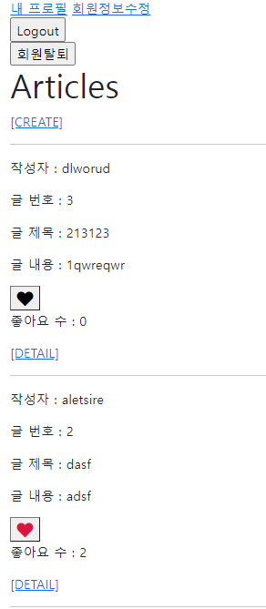

# Django Model Relationship


1. 좋아요에 활용되는 로고를 선택

2. index.html에 좋아요 여부에 따른 결과를 보여준다
3. 좋아요를 누른 경우 빨간색 하트, 그렇지 않은 경우 검은색 하트가 나타나도록 한다
4. 특정 글의 좋아요를 누른 전체 인원수를 출력한다 


												

### models.py

```python
from django.db import models
from django.conf import settings

class Article(models.Model):
    user = models.ForeignKey(settings.AUTH_USER_MODEL, on_delete=models.CASCADE)
    like_users = models.ManyToManyField(settings.AUTH_USER_MODEL, related_name='like_articles')
    title = models.CharField(max_length=10)
    content = models.TextField()
    created_at = models.DateTimeField(auto_now_add=True)
    updated_at = models.DateTimeField(auto_now=True)

    def __str__(self):
        return self.title
```

```python
related_name='like_articles'
# 를 추가해 주지 않으면, 에러가 발생한다
# 왜냐하면 like_users 필드 생성 시 자동으로 역참조는 .article_set 매니저를 생성
# 그러나 이전 1:N(User:Article) 관계에서 이미 해당 매니저 이름을 사용 중이기 때문
# User와 관계된 ForeignKey 또는 ManyToManyField 중 하나에 related_name 추가 필요
```


​															

### views.py

```python
@require_POST
def likes(request, article_pk):
    if request.user.is_authenticated:
        article = get_object_or_404(Article, pk=article_pk)
        if article.like_users.filter(pk=request.user.pk).exists():
            article.like_users.remove(request.user)
        else:
            article.like_users.add(request.user)
        return redirect('articles:index')
    return redirect('accounts:login')
```

```
QuerySetAPI - 'exists()'
- QuerySet에 결과가 포함되어 있으면 True를 반환하고 그렇지 않으면 False를 반환
- 특히 규모가 큰 QuerySet의 컨텍스트에서 특정 개체 존재 여부와 관련된 검색에 유용
- 고유한 필드(ex. primary key)가 있는 모델이 QuerySet의 구성원인지 여부를 찾는 가장 효율적인 방법
```


​																						

### index.html

```python



  <h1>Articles</h1>
  
    <a href="">[CREATE]</a>
  
    <a href="">[새 글을 작성하려면 로그인하세요.]</a>
  
  <hr>
  
    <p>작성자 : {{ article.user }}</p>
    <p>글 번호 : {{ article.pk }}</p>
    <p>글 제목 : {{ article.title }}</p>
    <p>글 내용 : {{ article.content }}</p>
    <div>
      <form action="" method ="POST">
        
        
          <button><i class="fas fa-heart fa-lg" style="color:crimson;"></i> </button>  
        
          <button><i class="fas fa-heart fa-lg" style="color:black;"></i></button>
        
      </form>
    </div>
    <p> 좋아요 수 : {{ article.like_users.count }}</p>
    <a href="">[DETAIL]</a>
    <hr>
  

```

