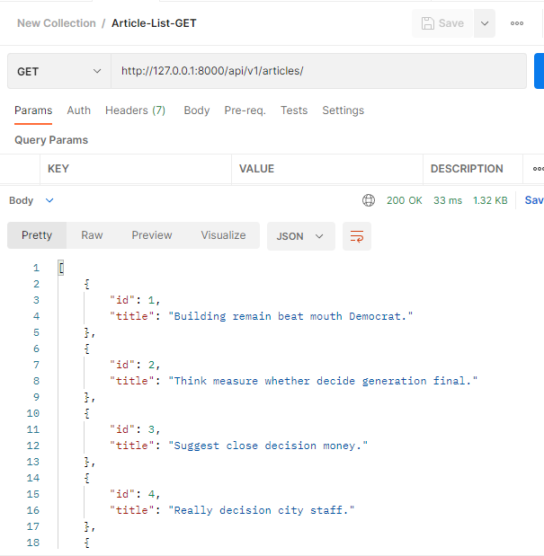
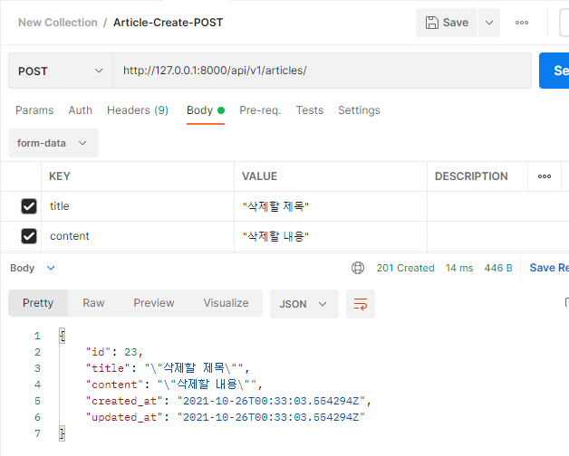
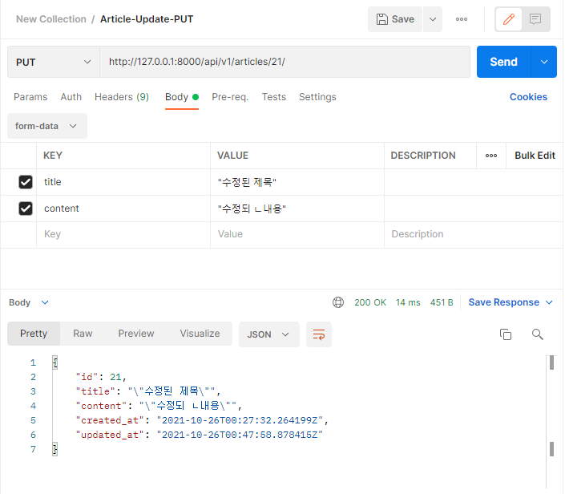
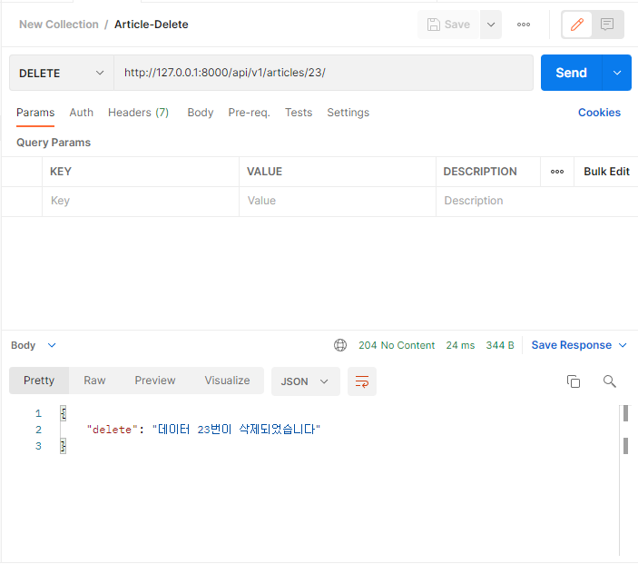

# Django REST Framework


- DRF를 활용하여 게시글 관련 REST API 서버를 구축하시오

​											

### 1. Model

```python
class Article(models.Model):
    title = models.CharField(max_length=100)
    content = models.TextField()
    created_at = models.DateTimeField(auto_now_add=True)
    updated_at = models.DateTimeField(auto_now=True)
```

```python
$ python manage.py seed articles --number=5
```


​															

### 2. serializers

```python
class ArticleListSerializer(serializers.ModelSerializer):
    class Meta:
        model = Article
        fields = ('id', 'title',)
        
class ArticleSerializer(serializers.ModelSerializer):
    class Meta:
        model = Article
        fields = '__all__'
```


​																						

### 3. url & views

#### url

```python
from django.contrib import admin
from django.urls import path, include

urlpatterns = [
    path('admin/', admin.site.urls),
    path('api/v1/', include('articles.urls')),
]

from django.urls import path
from . import views

urlpatterns = [
    path('articles/', views.article_list),
    path('articles/<int:article_pk>/', views.article_detail),
]
```


#### views

```python
# article_list에서 @api_view를 사용하는 이유는
# @api_view가 없으면 404 에러 -> HTML로 보여짐
# @api_view가 있으면 404 에러 -> Json으로 응답 
@api_view(['GET', 'POST'])
def article_list(request):
    if request.method == 'GET':
        articles = get_list_or_404(Article) # Queryset
        serializer = ArticleListSerializer(articles, many=True) # Json으로 만듬(Serialization)
        return Response(serializer.data)
    
    elif request.method == 'POST': # create
        serializer = ArticleSerializer(data=request.data)
        if serializer.is_valid(raise_exception=True): # raise_exception=True는 기본적으로 문제가 있을 경우 HTTP 400 코드를 응답함
            serializer.save()
            return Response(serializer.data, status=status.HTTP_201_CREATED)
```





```python
@api_view(['GET', 'DELETE', 'PUT'])
def article_detail(request, article_pk):
    article = get_object_or_404(Article, pk=article_pk)
    if request.method == 'GET':
        serializer = ArticleSerializer(article)
        return Response(serializer.data)

    elif request.method == 'DELETE':
        article.delete()
        data = {
            'delete': f'데이터 {article_pk}번이 삭제되었습니다.'
        }
        return Response(data, status=status.HTTP_204_NO_CONTENT)
    
    elif request.method == 'PUT':
        serializer = ArticleSerializer(article, data=request.data)
        # serializer = ArticleSerializer(instance=article, data=request.data)
        if serializer.is_valid(raise_exception=True):
            serializer.save()
            return Response(serializer.data)
```




