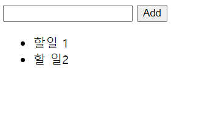
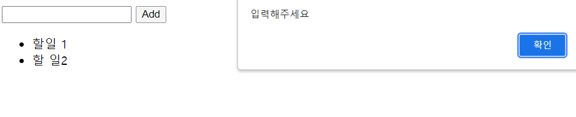

# JavaScript

####  제시된 CREATE, READ 기능을 충족하는 todo app을 완성하시오.

- form 태그를 사용한다. 
- form에서 submit 이벤트가 발생되었을 때 input에 작성된 값이 todo로 추가된다.
- todo는 ul 태그의 li 태그로 추가된다. 
- todo가 추가된 후 input value의 값은 초기화 된다. 
- (선택) 빈 값인 데이터는 입력을 방지한다. 
  - 빈 값이면 알림창을 띄워 값을 입력하도록 안내한다.

```html
<form action="'/todo/">
    <input type="text">
    <button>Add</button>
</form>
<ul>

</ul>
<script>
    // 이벤트 타겟 설정
    const form = document.querySelector('form')
    function addTOdo(event) {
        // event의 기본동작을 막는다
        event.preventDefault()

        // input 요소를 선택하고, value값을 저장한다
        const input = document.querySelector('input')
        const content = input.value

        if (content.trim()) {
            // 새로운 li 요소 생성, input value를 innerText로 넣는다
            const li = document.createElement('li')
            li.innerText = content

            // ul요소를 선택, ul의 자식 요소로 li 요소를 추가한다
            const ul = document.querySelector('ul')
            ul.appendChild(li)
        } else {
            alert('입력해주세요')
        }
        event.target.reset()
    }

    form.addEventListener('submit', addTOdo)

</script>
```




