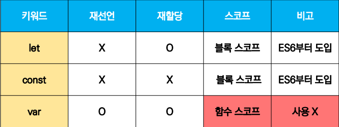

# Variable & Identifier

## 식별자

- 변수를 구분할 수 있는 변수명
- **반드시문자, 달러($)** 또는 **밑줄(_)**로 시작
- 대소문자를 구분, 클래스명 외에는 모두 소문자로 시작
- 예약어 사용불가능
  - 예약어: for, if, case 등

### 식별자 작성 스타일

- 카멜 케이스(camelCase)
  - 변수, 객체, 함수에 사용
- 파스칼 케이스(PascalCase)
  - 클래스, 생성자에 사용
- 대문자 스네이크 케이스(SNAKE_CASE)
  - 상수(constants)에 사용

### 변수 선언 키워드(let, const)

| const                                    | let                                       |
| :--------------------------------------- | ----------------------------------------- |
| - **재할당할 수 없는** 변수 선언 시 사용 | - **재할당 할 수 있는** 변수 선언 시 사용 |
| - 변수 **재선언 불가능**                 | - 변수 **재선언 불가능**                  |
| - 블록 스코프                            | - 블록 스코프                             |

> 블록스코프
>
> - if, for, 함수 등의 중괄호 내부를 가리킴
> - 블록 스코프를 가지는 변수는 블록 바깥에서 접근 불가능

```javascript
let x = 1
if (x===1) {
    let x =2
    console.log(x) //2
}
console.log(x) //1
```

> - 선언(Declaration)
>   - 변수를 생성하는 행위
> - 할당(Assignment)
>   - 선언된 변수에 값을 저장하는 행위
> - 초기화(Initialization)
>   - 선언된 변수에 처음으로 값을 저장하는 행위


#### 변수 선언키워드(var)

- var
  - var로 선언한 변수는 재선언 및 재할당 모두 가능
  - ES6 이전에 변수를 선언할 때 사용되던 키워드
  - 호이스팅되는 특성으로 인해 문제 발생 가능
  - 함수 스코프

```javascript
var number = 10 // 1. 선언 및 초기값 할당
var number = 50 // 2. 재할당

console.log(number) // 50
```


> 함수 스코프
>
> - 함수의 중괄호 내부를 가리킴
> - 함수 스코프를 가지는 변수는 함수 바깥에서 접근 불가능

```javascript
function example() {
    var x = 5
    console.log(x) // 5
}

console.log(x) // ReferenceError: x is not defined
```


> 호이스팅(hoisting)
>
> - 변수를 선언 이전에 참조할 수 있는 현상
> - 변수 선언 이전의 위치에서 접근 시 undefined를 반환

```javascript
console.log(username) // undefined
var username = '김이박'

console.log(username) // Uncaught ReferenceError
let username = '김이박'
```


